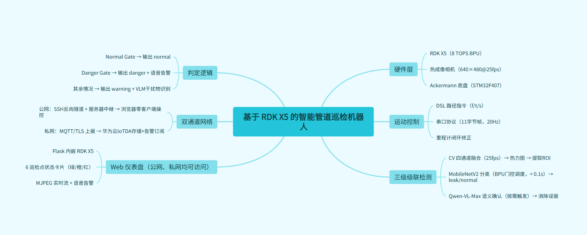

# Intelligent Pipeline Inspection Robot & Interactive Status Feedback System Based on RDK X5

> An end-to-end gas leak detection system integrating edge, server, and cloud. Autonomous navigation, AI detection, dual-channel remote access, full-loop closed.
>
> Detection accuracy 98.7% · Single-frame inference 87ms · Zero-client remote control

---

## 1. Overview

Gas leaks in chemical industrial parks are a major hazard. Traditional manual inspection is inefficient, exposes personnel to safety risks, and existing automated solutions suffer from high false-alarm rates and a lack of real-time remote feedback.

This system is built on the **D-Robotics RDK X5** (8 TOPS BPU), combined with an Ackermann robot chassis, a thermal imaging camera, and a self-hosted server, delivering a complete closed-loop pipeline: *autonomous navigation → AI detection → server alert → web dashboard*.

### System Architecture



### Key Features

- **Custom route cruising** — DSL command language (f/t/s), odometry closed-loop correction, one line defines the full inspection route
- **Three-stage cascaded AI detection** — CV feature extraction → MobileNetV2 classification → VLM semantic verification, on-demand compute scheduling, ~60% compute savings
- **Edge full-stack deployment** — Flask dashboard and AI inference co-located on the RDK X5 single node, no dedicated control PC required
- **Dual-channel remote access** — Public channel: SSH reverse tunnel directly to the robot (zero client); private channel: server storage & distribution; two channels back each other up
- **VLM false-positive suppression** — Qwen-VL-Max second-opinion verification reduces false-alarm rate from ~30% to single digits

### Performance Metrics

| Metric | Value |
|------|------|
| Detection accuracy | MobileNetV2 98.7% |
| BPU inference | < 0.1s/frame |
| CV throughput | 25fps (matches camera frame rate) |
| SNR | 3–5× improvement over single-channel |
| DL compute | ~60% reduction via cascade gating |
| Inspection duration | ≤ 10 min |
| Inspection coverage | 6 checkpoints |

---

## 2. Hardware & Deployment

### Hardware List

| Component | Model / Specs |
|------|----------|
| Core board | D-Robotics RDK X5, 8 TOPS BPU, 4 GB RAM |
| Chassis | Wheeltec Ackermann, STM32F407, 115200 bps serial |
| Thermal camera | 640×480@25fps, YUYV, MS210x capture |
| Power | 12 V Li-Ion battery + 22 V onboard supply + ROS adapter board — camera (12 V), motor driver (22 V), STM32 & RDK X5 (5 V / 3 A Type-C) |

### On-board Deployment (RDK X5, Ubuntu 20.04)

```
~/mobilenet_test/
├── main.py                    # One-click inspection entry
├── run.py                     # Launch script
├── preview.py                 # Camera preview + recording web service
├── preset_path_controller.py  # DSL route parser
├── vlm_check.py               # VLM semantic verification
├── iotda_test.py              # Data upload
├── gas_detection/             # Detection pipeline library
│   ├── config/                # Configuration (thresholds, parameters)
│   ├── core/                  # Scheduler (frame source, pipeline, result)
│   ├── cv_pipeline/           # 4-channel CV fusion
│   ├── dl_pipeline/           # DL classifier
│   ├── outputs/               # Upload / visualization / video writer
│   └── utils/                 # Image I/O utilities
└── model/
    └── gas_mobilenet.pth      # MobileNetV2
```

### PC-side Deployment

```
dashboard/
├── gas_dashboard.py           # Flask dashboard
└── robot_config.example.py    # SSH credentials template
```

---

## 3. Usage

The system provides two access modes: public internet (recommended) and LAN (offline / private-network scenarios).

### Public Access

1. Open `http://t30.sjcmc.cn:14054/` in a browser to reach the product landing page


2. Log in to enter the control console — live camera feed on the left, inspection status panel on the right
3. Enter a DSL route command directly in the route input box, e.g.:

```
f:0.5, s, t:-90, s
```

4. Click **Start Patrol** — the robot follows the route autonomously, stops at each checkpoint, and records thermal video
5. Detection results appear on the web page in real time — status cards change color (green / orange / red), result images and text conclusions refresh, voice alert triggers on leak


### LAN Access

For environments without public internet access. Start the dashboard service on a local PC:

```bash
python gas_dashboard.py
```

Any device on the same LAN can open the PC's LAN address in a browser and access the control console — the experience is identical to public access.

### DSL Route Commands

| Command | Meaning |
|------|------|
| `f:X` | Move forward X meters |
| `t:X` | Turn X degrees (positive = left, negative = right) |
| `s:X` | Stop & inspect (pause 1 s → record X s → pause 1 s) |

Commands are sent to the STM32 via a custom serial protocol (11-byte binary frames, 20 Hz control rate). The STM32 streams back speed and distance data in real time for odometry closed-loop correction.

---

## 4. Technical Principles

### Path Cruising Control

The user enters a DSL command (e.g. `f:0.5, s, t:-90, s`). `preset_path_controller.py` parses it into an action sequence and encodes each action as an 11-byte binary frame sent over serial (115200 bps, 20 Hz) to the STM32 chassis. The STM32 returns real-time odometry data (current speed, cumulative distance); the host compares against target values for PID closed-loop correction to ensure positioning accuracy. The robot stops automatically at each checkpoint and begins recording.

### Three-Stage Cascaded Detection


### Decision Logic

```
Normal Gate (any hit → normal):
  Optical flow tracked points inside ROI < 1.5
  Total ROI count < 1.2 × N
  Frames with ROI < 15%

→ All missed → Danger Gate:
  leak_rate ≥ 30% AND leak_frames ≥ 4 AND DL executed → danger (voice alert)

→ Otherwise → warning (report anomaly cause)
```

### Dual-Channel Network Architecture

| | Public Channel | Private Channel |
|------|---------|---------|
| Path | SSH reverse tunnel → t30.sjcmc.cn | SFTP/HTTP → server |
| Carries | Dashboard interaction + live video | Detection data storage & distribution |
| Traits | High bandwidth, low latency, zero client | Low bandwidth, persistent, reliable |
| Dependency | Windows Server SSH | Self-hosted HTTP service |

Two channels operate in parallel and back each other up.

### Model

| Item | Detail |
|------|------|
| Architecture | MobileNetV2 |
| Training data | GOD-Video ~280k thermal grayscale images |
| Input | 224×224 (grayscale replicated to 3 channels) |
| Output | leak / normal |
| Size | 9 MB (.pth) / ~4.5 MB (BPU .bin) |
| Inference | RDK X5 BPU, 87 ms/frame |

---

## License

[MIT](LICENSE) © 2026 SkyWing925
