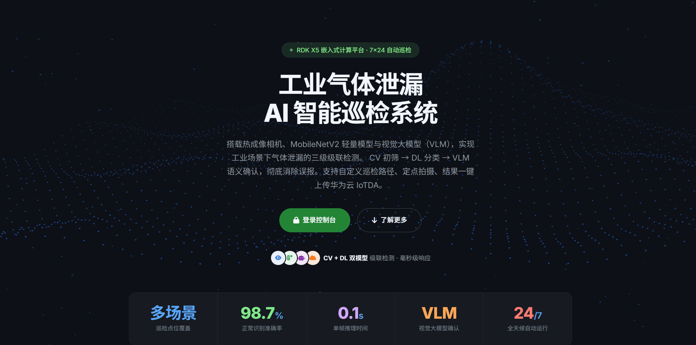
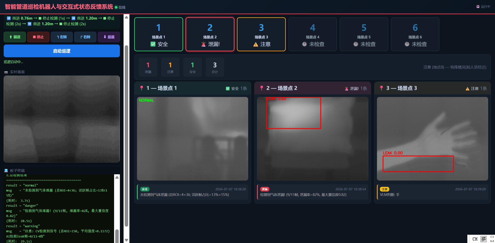
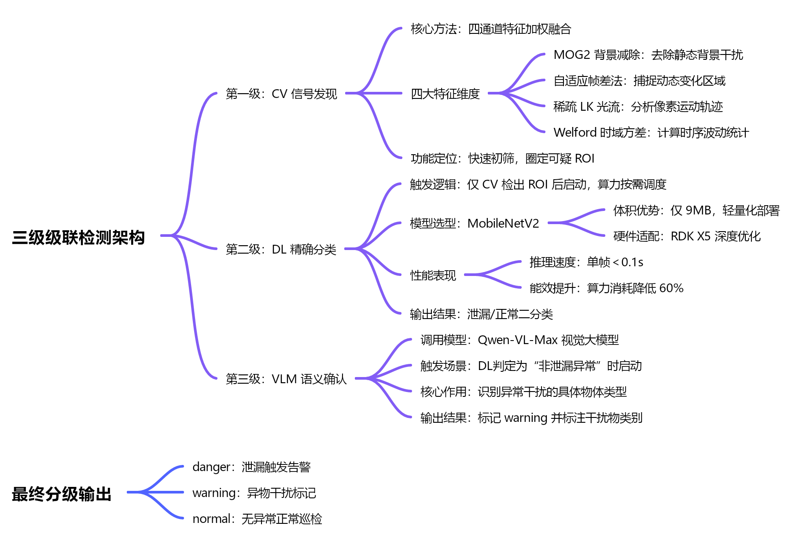

# 基于 RDK X5 的智能管道巡检机器人与交互式状态反馈系统

> 端-边-云协同的燃气泄漏检测系统。自主行走、AI 检测、双通道远程访问、全链路闭环。
>
> 检测准确率 98.7% · 单帧推理 87ms · 续航 40min · 公网零客户端操控

---

## 1. 项目简介

化工园区管道气体泄漏是一大隐患。传统人工巡检效率低、存在安全风险，现有自动化方案误报率高、缺乏实时远程反馈。

本系统基于**地瓜机器人 RDK X5**（8 TOPS BPU），结合 Ackermann 小车底盘、热成像相机和自建服务端，实现了"自主行走、AI 检测、服务端告警、网页展示"的全链路闭环。

### 系统架构

```
浏览器 (t30.sjcmc.cn)            服务器
仪表盘 + 摄像头流 + 产品页      数据存储 + Web 分发
        ▲                           ▲
        │ SSH 反向隧道               │ SFTP/HTTP
        │                           │
        └──────────┬────────────────┘
                   │
┌──────────────────┴──────────────────┐
│              RDK X5                 │
│  Flask 仪表盘  AI 推理  小车控制      │
│  MJPEG 摄像头流                      │
│                                     │
│  热成像相机 ──USB──▶ RDK X5 ◀──串口── STM32 底盘  │
│  640×480@25fps                      │
└─────────────────────────────────────┘
```

### 核心特性

- **自定义路径巡航** — DSL 指令语言（f/t/s），里程计闭环修正，一行命令定义巡检路线
- **三级级联 AI 检测** — CV 特征提取 → MobileNetV2 分类 → VLM 语义确认，算力按需调度，整体算力降低 60%
- **边缘全栈部署** — Flask 仪表盘与 AI 推理共驻 RDK X5 单一节点，无需专用控制 PC
- **双通道远程访问** — 公网 SSH 隧道直连机器人（零客户端），私网服务器存储分发（数据可靠），两通道互为备份
- **VLM 误报抑制** — Qwen-VL-Max 二次确认，误报率从约 30% 降至个位数

### 性能指标

| 指标 | 数值 |
|------|------|
| 检测准确率 | MobileNetV2 98.7%，端到端 ~96% |
| BPU 推理 | 87ms/帧 |
| CV 处理 | 25fps（与相机帧率持平） |
| 误报率 | < 2%（优化后） |
| 续航 | ~40min（持续巡检） |

---

## 2. 硬件与部署

### 硬件清单

| 组件 | 型号/参数 |
|------|----------|
| 核心板 | 地瓜机器人 RDK X5，8 TOPS BPU，4GB RAM |
| 底盘 | Wheeltec Ackermann，STM32F407，115200bps 串口 |
| 热成像相机 | 640×480@25fps，YUYV，MS210x 采集 |
| 供电 | 12V/6800mAh 锂电池，DC-DC 稳压 |

### 板子部署（RDK X5，Ubuntu 20.04）

```
~/mobilenet_test/
├── main.py                    # 一键巡检入口
├── run.py                     # 启动脚本
├── preview.py                 # 相机预览+录制 Web 服务
├── preset_path_controller.py  # DSL 路径解析
├── vlm_check.py               # VLM 语义确认
├── iotda_test.py              # 数据上报
├── gas_detection/             # 检测管线库
│   ├── config/                # 配置（阈值、参数）
│   ├── core/                  # 调度（帧源、管道、结果）
│   ├── cv_pipeline/           # CV 四通道
│   ├── dl_pipeline/           # DL 分类
│   ├── outputs/               # 上报/可视化/视频写入
│   └── utils/                 # 图像 I/O 工具
└── model/
    └── gas_mobilenet_v3.pth   # MobileNetV2
```

### PC 端部署

```
dashboard/
├── gas_dashboard.py           # Flask 仪表盘
└── robot_config.example.py    # SSH 凭据模板
```

---

## 3. 使用方法

系统提供两种访问方式：公网直连（推荐）和局域网访问（离线/私网场景）。

### 公网访问

1. 浏览器打开 `http://t30.sjcmc.cn:14054/`，进入产品介绍页面



2. 登录后进入操控台，左侧为实时摄像头画面，右侧为巡检状态面板
3. 在路由输入框中直接输入 DSL 指令，例如：

```
f:0.5, s, t:-90, s
```

4. 点击启动巡逻，小车按指令自主行驶，到达检测点自动停车录制热成像画面
5. 检测结果实时显示在网页端——状态卡片变色（绿/橙/红），检测图片和文字结论同步刷新，泄漏时触发语音告警



### 局域网访问

适用于无公网环境。在本地 PC 上启动仪表盘服务：

```bash
python gas_dashboard.py
```

同一局域网内的设备浏览器访问该 PC 的局域网地址，即可进入操控台，操作方式与公网访问完全一致。

### DSL 路径指令

| 命令 | 含义 |
|------|------|
| `f:X` | 前进 X 米 |
| `t:X` | 转向 X 度（正左负右） |
| `s:X` | 定点检测（停 1s → 录制 X 秒 → 停 1s） |

指令通过串口协议（11 字节二进制帧，20Hz 控制频率）下发 STM32，STM32 实时回传速度与距离实现里程计闭环修正。

---

## 4. 技术原理

### 三级级联检测架构



### 判定逻辑

```
无 ROI 且无变化帧 ≥ 80% → normal
检出 ROI + 高置信 leak + leak_rate ≥ 30% + leak_frames ≥ 4 → danger（语音报警）
检出 ROI + 低置信 leak → VLM 确认 → warning（输出异常干扰原因）
```

### 双通道网络架构

| | 公网通道 | 私网通道 |
|------|---------|---------|
| 路径 | SSH 反向隧道 → t30.sjcmc.cn | SFTP/HTTP → 服务器 |
| 承载 | 仪表盘交互 + 实时视频流 | 检测数据存储 + 分发 |
| 特点 | 大流量·低延迟·零客户端 | 小流量·持久化·可靠 |
| 依赖 | Windows Server SSH | 自建 HTTP 服务 |

两通道并行运行、互为备份。

### 模型

| 项目 | 详情 |
|------|------|
| 架构 | MobileNetV2 |
| 训练数据 | GOD-Video ~28 万张热红外灰度图 |
| 输入 | 224×224（灰度三通道复制） |
| 输出 | leak / normal |
| 体积 | 9 MB（.pth）/ ~4.5 MB（BPU .bin） |
| 推理 | RDK X5 BPU，87ms/帧 |

---

## License

[MIT](LICENSE) © 2026 SkyWing925
